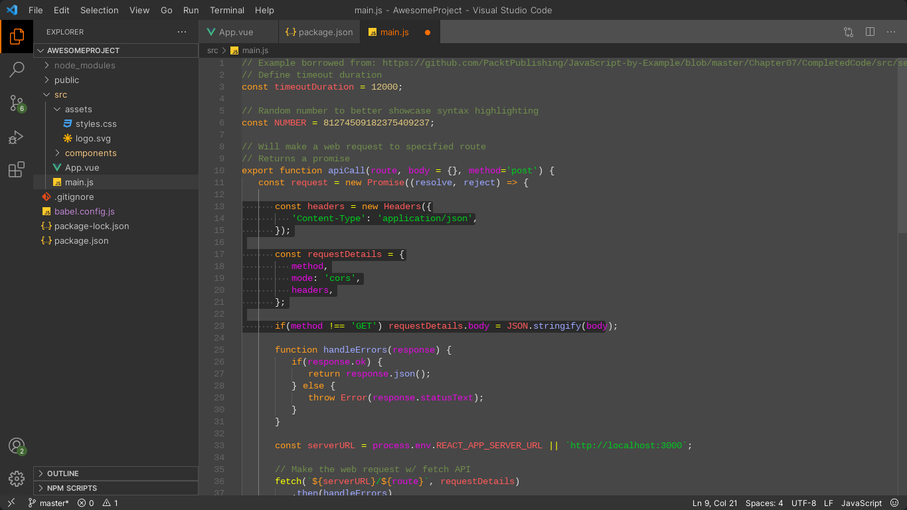
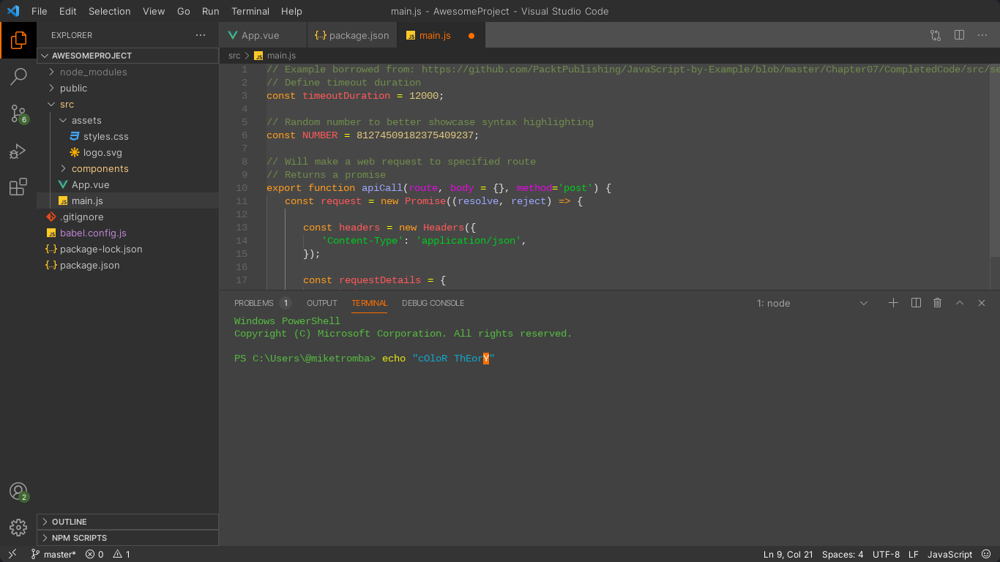
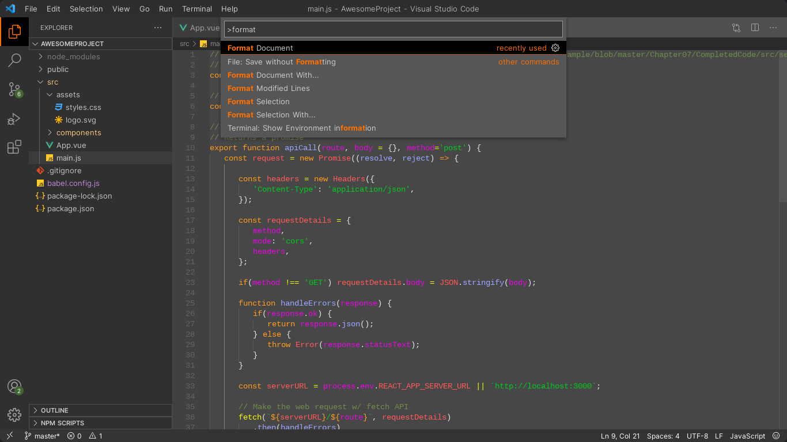

Mesh Void's Theme for VS Codium or Visual Studio Code

There's not enough gray themes out there, so I decided to create my own.

Introducing MeshVoid Theme. Available on open-vsx.org and VS Code marketplace.

